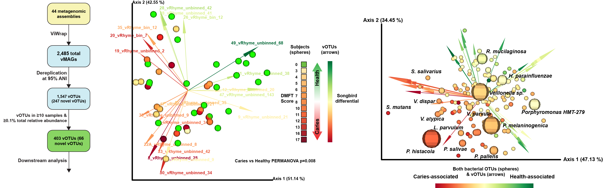

# Caries associated virome

This repository contains the code and data associated with "The salivary virome during childhood dental caries" by Jonah Tang and Jonathon L. Baker. 

## Abstract
Dental caries is the most common chronic infectious disease, worldwide, and is caused by a dysbiosis of the oral microbiome featuring an increased abundance of acid-tolerant, acid-producing, and biofilm-forming bacteria.  The oral microbiome also contains viruses; however, virtually nothing is known about the the caries-associated virome. In this study, the salivary viromes of 21 children with severe caries (>2 dentin lesions) and 23 children with healthy dentition were examined.  2,485 viral metagenome-assembled genomes (vMAGs) were identified, binned, and quantified from the metagenomic assemblies.  These vMAGs were mostly phage, and represented 1,547 unique species-level vOTUs, 247 of which appear to be novel.  The metagenomes were also queried for all 3,835 unique species-level vOTUs of DNA viruses with a human host on NCBI Virus, however all but *Human betaherpesvirus 7* were at very low abundance in the saliva.  **The oral viromes of the children with caries exhibited significantly different beta diversity compared to the oral virome of the children with healthy dentition**; several vOTUs predicted to infect *Pauljensenia* and *Neisseria* were strongly correlated with health, and two vOTUs predicted to infect Saccharibacteria and *Prevotella histicola*, respectively, were correlated with caries.  Co-occurrence analysis indicated that phage typically co-occurred with both their predicted hosts and with bacteria that were themselves associated with the same disease status.  Overall, this study provided the sequences of 53 complete or nearly complete novel oral phages and illustrated the significance of the oral virome in the context of dental caries, which has been largely overlooked.  This work represents an important first step towards a better understanding of oral inter-kingdom interactions and identification of potential phage-based caries therapeutics.

## Supplemental Methods & Files

### Supplemental Methods
The Supplemental-Methods folder contains the [Supplemental-Methods](Supplemental-Methods/supplemental_methods-JLB.md) markdown file, which contains all the extended methods, code and scripts used in this study.

### QZV files
The [QZV-files](QZV-files/) folder contains interactive QIIME 2 visualization files (may be visualized at https://view.qiime2.org) enabling readers to examine the datasets from Figure 2, Panels A, C, D, and E in 3-D, visualize metadata in different ways, and click on individual data points for more information.

### Complete and high-quality novel genomes
The [complete-and-hq-novel-genomes](complete-and-hq-novel-genomes) folder contains FASTA files of the 53 vOTUs that were novel (i.e., had no match at >95% ANI in either NCBI Virus or the Oral Virus Database [OVD]) and were also rated as either 'complete' or 'high-quality' by [ViWrap/CheckV](https://github.com/AnantharamanLab/ViWrap/tree/main). These genomes have been submitted to NCBI GenBank and a link to the accession number will be posted here after the process is complete.

### Novel genomes
The [novel_genomes](novel-genomes) folder contains FASTA files for all 247 vOTUs that were novel (i.e., had no match at >95% ANI in either NCBI Virus or the [Oral Virus Database](https://www.cell.com/iscience/fulltext/S2589-0042(22)00689-7?_returnURL=https%3A%2F%2Flinkinghub.elsevier.com%2Fretrieve%2Fpii%2FS2589004222006897%3Fshowall%3Dtrue)).

### All cluster rep genomes
The [all_cluster_rep_genomes](all_cluster_rep_genomes) folder contains FASTA files for all 1,547 unique vOTUs identified in the metagenomes analyzed in this study.

### All ViWrap genomes
The [all-viwrap-genomes](all-viwrap-genomes) folder contains FASTA files for all 2,485 vMAGs identified in the metagenomes analyzed in this study.
