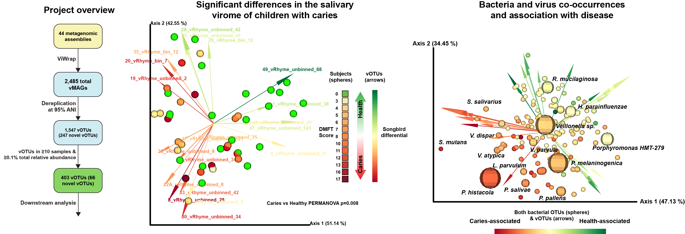

# Caries associated virome

This repository contains the code and data associated with "The salivary virome during childhood dental caries" by Jonah Tang and Jonathon L. Baker. 

## Abstract
While many studies have examined the bacterial taxa associated with dental caries, the most common chronic infectious disease globally, little is known about the caries-associated virome. In this study, the salivary viromes of 21 children with severe caries (>2 dentin lesions) and 23 children with healthy dentition were examined. 2,485 viral metagenome-assembled genomes (vMAGs) were identified, binned, and quantified from the metagenomic assemblies. These vMAGs were mostly phage, and represented 1,865 unique species-level viral operational taxonomic units (vOTUs), 478 of which appear to be novel.  The metagenomes were also queried for all 3,858 unique species-level vOTUs of DNA viruses with a human host on NCBI Virus, however all but *Human betaherpesvirus 7* were at very low abundance in the saliva. **The oral viromes of the children with caries exhibited significantly different beta diversity compared to the oral virome of the children with healthy dentition;** several vOTUs predicted to infect *Haemophilus* and *Neisseria* were strongly correlated with health, and a few vOTUs predicted to infect Saccharibacteria and *Veillonella* were correlated with caries. Co-occurrence analysis indicated that phage typically co-occurred with both their predicted hosts and with bacteria that were themselves associated with the same disease status. Overall, this study provided the sequences of 35 complete or nearly complete novel oral phages and illustrated the potential significance of the oral virome in the context of dental caries, which has been largely overlooked. This work represents an important step towards the identification and study of phage therapy candidates which treat or prevent caries pathogenesis.

## Supplemental Methods & Files

### Supplemental Methods
The Supplemental-Methods folder contains the [Supplemental-Methods](Supplemental-Methods/supplemental-methods.md) markdown file, which contains all the extended methods, code and scripts used in this study.

### QZV files
The [QZV-files](QZV-files/) folder contains interactive QIIME 2 visualization files (may be visualized at https://view.qiime2.org) enabling readers to examine the datasets from Figure 2, Panels A, E, F, and G in 3-D, visualize metadata in different ways, and click on individual data points for more information.

### Complete and high-quality novel genomes
The [complete-and-hq-novel-genomes](complete-and-hq-novel-genomes) folder contains FASTA files of the 35 vOTUs that were novel (i.e., had no match at >95% ANI or >85% AF in either NCBI Virus or five other viral databases; see section below for details) and were also rated as either 'complete' or 'high-quality' by [ViWrap/CheckV](https://github.com/AnantharamanLab/ViWrap/tree/main). These genomes have been submitted to NCBI GenBank and a link to the accession number will be posted here after the process is complete.

### Novel genomes
The [novel_genomes](novel-genomes) folder contains FASTA files for all 478 vOTUs that were novel; i.e. having no match at >95% ANI and >85% AF in either NCBI Virus or five different viral databases: Oral Virome Database (OVD, 48,425 genomes; PMID:35663034), Gut Virome Database (GVD, 33,242 genomes; PMID: 32841606), Gut Phage Database (GPD, 142,809 genomes; PMID: 33606979), Metagenomic Gut Virus catalogue (189,680 genomes, PMID: 34168315), and IMG/VR4 (15,722,824 genomes, PMID: 36399502).

### All cluster rep genomes
The [all_cluster_rep_genomes](all_cluster_rep_genomes) folder contains FASTA files for all 1,865 unique vOTUs identified in the metagenomes analyzed in this study.

### All ViWrap genomes
The [all-viwrap-genomes](all-viwrap-genomes) folder contains FASTA files for all 2,485 vMAGs identified in the metagenomes analyzed in this study.

### NCBI Accession Table
This file is a table linking the contigs of each complete and high-qualty novel genome to their respective NCBI BioProject, BioSample, and SRR accession numbers.

### SeqIDs
This file is a table linking the contigs of each complete and high-qualty novel genome to their respective NCBI GenBank accession number.
